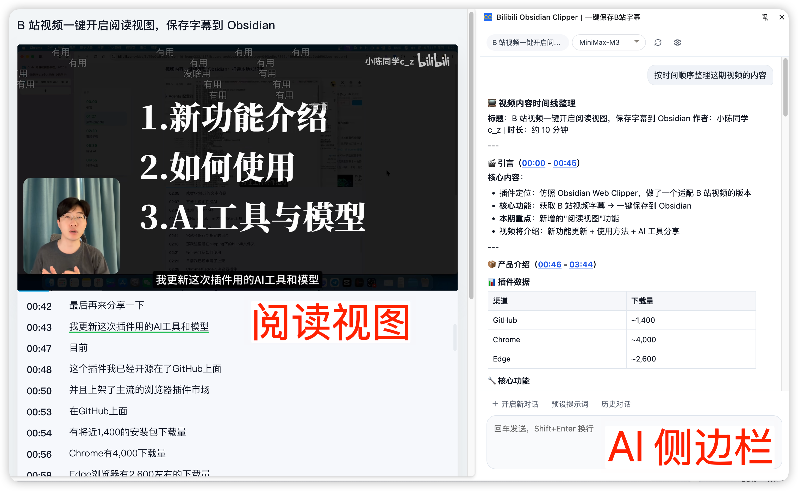

# Bilibili-Summary｜一键总结 B 站视频

> **本仓库说明**：本项目基于 [haixiong1997/Bilibili-Obsidian-Clipper](https://github.com/haixiong1997/Bilibili-Obsidian-Clipper) 二次修改，沿用原仓库的 MIT License。

> UI 设计参考了 [YouTube Digest](https://github.com/zarazhangrui/youtube-digest)。

一个开源的浏览器扩展，在 B 站视频页侧边栏中整合字幕阅读、AI 总结、内容讲解和时间戳笔记。你可以在不离开视频页面的前提下，持续学习视频内容，同时保留原视频上下文。

- 自动抓取视频字幕，支持 Markdown 复制和字幕文件下载
- 侧边栏内直接查看 AI 生成的章节概览、重点引用和内容讲解
- 点击字幕或笔记中的时间戳，快速跳转到对应播放位置
- 围绕字幕内容进行多轮对话，追问细节或拓展知识点
- 无字幕时自动尝试语音识别回退
- 所有数据保存在本地浏览器，不包含统计追踪或第三方数据中转

本项目需要自行提供 API Key，不会赠送免费额度，也不提供代持密钥的云端服务。

## 功能

### 字幕与时间戳跳转

- 自动抓取 B 站视频字幕（自动识别当前分 P），支持 Markdown 预览复制和 `srt/txt` 下载
- 字幕逐句带时间戳，点击即可跳转到对应播放位置
- 支持句内搜索、跟随播放滚动，无字幕时自动尝试语音识别回退（SiliconFlow / 本地 Whisper）
- AI 回答中的时间戳也会自动变成可点击跳转链接

### 章节概览与金句收集

- 「概览」标签页自动生成视频章节和重点引用，打开即呈现
- 章节按视频结构分段，点击直接跳播对应位置
- 金句卡片独立展示，方便快速定位视频核心观点
- 支持保存和导出带时间戳的笔记，后续复习时可直接回溯

### AI 对话栏

- 侧边栏内直接围绕字幕内容进行多轮对话，追问细节或拓展知识点
- 内置预设提示词、模型切换、深度思考开关、历史对话等能力
- 播放器内 AI 快捷按钮支持一键生成视频摘要，无需手动触发
- 选中字幕后可弹出「解释」卡片，并一键发送到对话栏继续追问
- 支持多平台模型切换，回答内容中的时间戳同样可点击跳转

# 

## 功能图片演示




## 安装方式

> 仅支持 Chrome / Edge 等 Chromium 浏览器（依赖 sidePanel、offscreen 等 Chrome 专属 API），不支持 Firefox。

### 方式一：下载打包版本（推荐）

1. 解压下载的 zip 包到任意长期保留的文件夹
2. 打开扩展管理页：
   
   - Chrome：`chrome://extensions/`
   
   - Edge：`edge://extensions/`
3. 开启"开发者模式"
4. 点击"加载已解压的扩展程序"，选择解压后的文件夹

### 方式二：从源码构建

```bash
git clone https://github.com/Edmund724/Bilibili-Summary.git
cd Bilibili-Summary
npm install
npm run build          # 生成 dist/（content 分包 + 各入口 bundle，含 sourcemap）
npm run dev            # watch 模式：首轮全量构建到 dist/ 后持续重建，改代码即生效
npm run build:release  # 生成 Chrome 打包到 release/（zip 不含 sourcemap）
```

日常开发：跑 `npm run dev`，在扩展管理页「加载已解压的扩展程序」选择 `dist/`，重建后点扩展的刷新按钮即可。

### 方式三：让编程 Agent 帮你安装

无需编程基础，也不用命令行操作。把下面这段话发送给你的编程 Agent：

> 请把这个项目下载或克隆到我选择的长期保留文件夹，告诉我准确的完整路径，并让 Chrome"加载已解压的扩展程序"使用同一个文件夹。如果我在第一次安装时需要位置建议，可以推荐 macOS 或 Linux 上的 `~/Documents/bilibili-summary`，或 Windows 上的 `%USERPROFILE%\Documents\bilibili-summary`，但不要假设我一定使用这些路径。请用简单易懂的语言一步一步指导我完成安装和配置。https://github.com/Edmund724/Bilibili-Summary

你的 Agent 应该帮你：

1. 先确认你想把项目放在哪里，再下载到该位置，并告诉你完整路径。如果你需要建议，可以推荐 macOS 或 Linux 上的 `~/Documents/bilibili-summary`，或 Windows 上的 `%USERPROFILE%\Documents\bilibili-summary`。
2. 打开下方硅基流动和 ModelScope 官方页面，指导你创建自己的账号。
3. 指导你在 Chrome 中通过"加载已解压的扩展程序"选择项目文件夹。
4. 告诉你应该在扩展的"设置"页面哪个位置填写 API Key。
5. 打开一个有字幕的 B 站视频，确认字幕、阅读视图和 AI 对话功能可以使用。

安装后请让这个文件夹留在原位。如果移动或删除它，Chrome 中加载的本地扩展会失效，需要从新的存放位置重新加载。

不要把 API Key 发送到 AI 对话、源代码、截图或公开消息中。请你自己在 Bilibili Summary 的设置页面直接填写。编程 Agent 可以告诉你填写位置，但不需要看到 Key。

## 设置 API Key

Bilibili-Summary 需要你在自己的服务账号中准备两个 Key：

1. **硅基流动 API Key**，用于无字幕视频的语音转写。
2. **ModelScope API Key**，用于 AI 总结和对话。

### 获取硅基流动 API Key

1. 打开硅基流动官方[注册页面](https://siliconflow.cn/)。
2. 创建账号并登录。
3. 在控制台中找到 API Key 管理页，创建一个新的 API Key。
4. 复制 Key，并粘贴到 Bilibili Summary 设置中的 **硅基流动 API Key**。

如果页面流程发生变化，请查看 [硅基流动官方文档](https://docs.siliconflow.cn/)。

### 获取 ModelScope API Key

1. 打开 ModelScope 官方[注册/登录页面](https://modelscope.cn/)。
2. 创建账号或登录。ModelScope 提供每日签到机制，每日访问官网并登录即可完成签到，获取免费积分；积分可直接用于 AI 总结和对话，无需额外付费。
3. 在用户页或 API 管理页中创建 SDK Token（格式通常为 `ms-` 开头）。
4. 复制 Token，并粘贴到 Bilibili Summary 设置中的 **ModelScope API Key**。
5. 如果 ModelScope 提示积分不足，请在 ModelScope 官网完成当日签到，或检查账号额度与限速。

当前账号和接口说明请查看 [ModelScope 官方 API 文档](https://modelscope.cn/docs/intro/model-service)。

在阅读面板（Digest）右上角打开 **设置** 抽屉（齿轮按钮）。Key 只能粘贴到这些设置输入框中。不要把 Key 发送到 AI 对话、项目文件、截图或公开消息中。

发布版本推荐使用 ModelScope：

```text
Base URL: https://api-inference.modelscope.cn/v1
Model: deepseek-ai/DeepSeek-V3.1 或其他 ModelScope 可用模型
```

Bilibili Summary 不会锁定模型，你可以在设置中自由切换。如果 ModelScope 积分不足或希望使用其他服务，也可以在「AI 模型平台」中添加其他平台。关于 ModelScope 每日签到免费积分和语音转写额度，请查看下方「免费额度与成本」章节。

API Key 和设置保存在你设备上的 Chrome 扩展本地存储中。发布包不会包含或使用 `config.js`。

## 使用方式

1. 打开一个带有字幕的 B 站视频页面。
2. 点击 Bilibili Summary 扩展图标或视频下方的 Digest 按钮，打开侧边栏。
3. 阅读带时间戳的字幕。
4. 切换到 **AI 标签页**，查看 AI 生成的视频摘要，或围绕字幕内容进行多轮对话。
5. 选中字幕，获取 AI 内容讲解或保存带时间戳的笔记。
6. 从播放器或重点引用中保存笔记，之后可以在侧边栏中查看。

## 当前支持范围

- Chrome 116 或更高版本。
- 标准的 `bilibili.com/video` 视频页面。
- B 站原生字幕。Bilibili Summary 会优先请求中文字幕，也可能显示其他可用的原生语言。
- AI 总结、选中文本讲解、翻译和自动润色笔记。
- 本地笔记，以及最近字幕、概览和翻译的本地缓存。
- 无字幕视频的语音识别回退（硅基流动 / 本地 Whisper）。

稍后再看页面的阅读视图体验尚不完善，但 AI 侧边栏和播放器快捷按钮已经支持。Shorts、直播、私密视频、受访问限制的视频，以及没有原生字幕的视频可能无法使用。目前没有测试 Firefox、Safari、移动浏览器或其他 Chromium 浏览器。

## 免费额度与成本

### 硅基流动

硅基流动提供免费语音转写额度，无字幕视频的音频转写通常不收费或仅收取极低费用。使用前请查看 [硅基流动定价页面](https://siliconflow.cn/pricing) 确认最新规则。

### ModelScope

截至文档更新时间，ModelScope 提供每日签到免费积分，注册账号并每日访问官网登录即可完成签到。积分可用于调用模型进行 AI 总结和对话。如果积分不足，请在 ModelScope 官网完成当日签到。ModelScope 与硅基流动的额度分开计算。Bilibili Summary 不收款，也不转售 API 服务。建议为账号设置消费上限并定期查看用量。

## AI 配置与平台支持

首次使用 AI 功能前，需要配置 AI 模型平台。设置入口在阅读面板（Digest）右上角的齿轮按钮——点击打开「设置」抽屉即可看到全部设置项（原独立设置页已并入侧边栏）：

1. 打开阅读面板 → 点击右上角齿轮（设置）
2. 在「AI 模型平台」区域点击「+ 添加平台」
3. 选择平台预设（会自动填充 API Base URL），或选择「自定义」手动填写
4. 填写 API Key 和模型名称（点击模型名称旁的箭头可自动拉取可用模型列表）
5. 点击「测试」按钮验证连接；测试成功后配置自动保存

设置抽屉中还可按需调整：

- **AI 按钮**：开启播放器内 AI 快捷按钮，自定义提示词
- **AI 对话 - 系统提示词**：设定 AI 的全局行为偏好
- **AI 对话 - 初始问题**：设置新视频的快捷提问入口（最多 4 条）
- **导出 / 笔记属性**：下载格式、Frontmatter 字段、自定义属性与正文附加段落等

### 已支持的平台预设

本扩展支持 OpenAI 兼容协议的 AI 服务，内置以下平台预设：

| 平台           | 预设名称        |
| ------------ | ----------- |
| OpenAI       | OpenAI 兼容   |
| DeepSeek     | DeepSeek    |
| 阿里通义千问       | Qwen        |
| 智谱 GLM       | GLM         |
| 月之暗面 Kimi    | Kimi        |
| MiniMax      | MiniMax     |
| Mimo         | Mimo        |
| Opencode Go  | Opencode Go |
| OpenRouter   | OpenRouter  |
| 阶跃星辰         | Stepfun     |
| ModelScope   | ModelScope  |
| Ollama（本地部署） | Ollama (本地) |

如果没有您使用的平台，可选择「自定义」预设，手动填写该平台的 API Base URL（需兼容 OpenAI 协议）即可。

## 项目结构

```
extension/
├── manifest.json          # 扩展清单
├── entry/                 # 入口（background、content、offscreen）
├── ai/                    # AI 客户端、SSE 流式解析、播放器 AI 按钮
├── asr/                   # 语音识别（音频分片、转写、WAV 编码）
├── bilibili/              # B 站 API 网关与视频 ID 解析
├── core/                  # 核心状态、运行时、消息处理
├── notes/                 # 笔记/导出渲染（Markdown、SRT、TXT）
├── subtitle/              # 字幕抓取、缓存与处理
├── reader/                # 阅读视图（生命周期/同步/布局）
├── ui/                    # UI 渲染（面板、Markdown、时间戳导航）
├── shared/                # 跨模块工具（DOM、日志、字符串处理等）
└── icons/                 # 扩展图标
```

> `extension/entry/content-bootstrap.iife.js`、`entry/content-main.mjs` 与 `entry/chunks/` 是构建产物，由 `npm run build` 生成（content 部分由 scripts/build-content.js 产出），已加入 `.gitignore`，请勿手动编辑。

## 二次开发与个性化

项目完全开源，你可以下载源码后，用 AI 编程工具按个人工作流修改功能。

常见修改方向：

1. 用 `git clone` 下载源码到本地
2. 用 Cursor、Codex、Claude Code 等 AI 编程工具打开项目文件夹
3. 描述你想调整的功能，例如：
   
   - 调整 AI 总结视频的提示词和输出格式
   
   - 新增自定义总结命令或快捷方式
   
   - 修改视频总结的触发方式（自动总结 / 播放器按钮 / 侧边栏手动触发）
4. 修改完成后跑 `npm run build`（或开发时直接 `npm run dev` 持续重建），在浏览器扩展管理页选择 `dist/` 文件夹进行本地加载
5. 打开 B 站视频页测试字幕抓取、AI 对话和视频总结是否正常

建议先本地测试确认正常，再替换日常使用版本；修改前建议备份原始代码，以便回退。

你可以尝试：

- 调整 AI 总结视频的提示词和输出格式
- 新增自定义总结命令或快捷方式
- 修改视频总结的触发方式（自动总结 / 播放器按钮 / 侧边栏手动触发）
- 增加更多翻译语言或自定义总结模板
- 增加生词本功能，保存单词、原句、解释和视频时间戳
- 把笔记和生词导出到 Markdown、CSV、Anki 或其他学习工具
- 增加主题筛选，只展示与你目标相关的章节
- 增加本地模型选项，获得不同的隐私和成本方案
- 改善键盘操作、字体大小和高对比度等无障碍体验

请保持用户自行填写 API Key 的方式，不要将密钥硬编码到源码中。修改后请运行下方检查，并在真实视频上测试。

如需切换到其他 AI 平台或模型，先用编程 Agent 打开你在 Chrome 中加载的同一个项目文件夹。然后打开 Bilibili Summary 设置并点击 **Copy customization prompt**。发送前替换 `[PROVIDER]` 和 `[MODEL]`，但不要加入任何 API Key。Agent 修改完代码后，请自行在对应设置项填写 Key。

## 隐私和数据流向

Bilibili Summary 会直接从扩展向服务商发送请求：

1. 从 B 站获取原生字幕数据。
2. 当你使用 AI 功能时，把字幕和相关视频信息发送给 ModelScope 或其他自行配置的 AI 平台。
3. 翻译或讲解等功能只发送当前需要的内容，例如选中的文本和上下文，或少量字幕分段。
4. 开启「无字幕视频语音识别回退」后，无字幕视频的音频会发送到你自行配置并选用的语音识别平台（如硅基流动）进行转写，具体发送哪些数据以该平台的服务条款为准。内置的「本地 Whisper」预设连接的是本机自部署的转写服务，音频数据不出本机；不开启语音识别回退时，本工具不会抓取或上传任何音频。
5. API Key、设置、笔记和最近缓存保存在 Chrome 本地。

Bilibili Summary 没有账号系统、广告、分析统计或行为追踪。硅基流动和 ModelScope 仍会按照各自的条款和隐私政策处理数据。详情请查看 [PRIVACY.md](PRIVACY.md)。

## 常见问题

### 为什么有些视频没有字幕？

本工具默认仅支持获取播放器中带有「字幕」选项的视频。如果播放器里没有字幕选项，说明该视频没有字幕轨（作者未上传外挂字幕，且平台未生成 AI 字幕）。此时如果你已在设置页配置了语音识别平台并开启「无字幕自动语音识别」，本工具会自动抓取该视频的音频并转写成字幕，无需手动操作；未配置平台时则保持原有的无字幕提示。已有字幕轨的视频不受影响，不会触发语音识别，也不会请求任何音频数据。

### 模型下拉列表为空或拉取失败是什么原因？

下拉列表会从配置的 API Base URL 拉取 `/v1/models` 接口返回的模型列表。如果列表为空或报错，请检查：

- API Base URL 是否正确且可访问
- API Key 是否有效（部分平台需要 Key 才能查看模型列表）
- 该平台是否兼容 OpenAI `/v1/models` 接口规范

如果平台不支持模型列表接口，可直接在模型名称输入框中手动填写模型名称。

### 测试按钮报错怎么办？

点击「测试」按钮会发送一次最小化的 AI 请求来验证连接。如果报错，请先确认 API Base URL、API Key 和模型名称均已正确填写；同时检查网络环境是否能访问对应平台的服务。

### 为什么只支持 Chrome / Edge，不支持 Firefox？

「一键总结」依赖 sidePanel 与 offscreen 两个 Chrome 专属 API，Firefox 下侧边栏、音频解码/转写等核心功能无法工作，因此发布只提供 Chrome 变体（Chrome / Edge 等 Chromium 浏览器均可使用）。

### 稍后再看页面和普通视频页有什么区别？

普通视频页的字幕抓取、阅读视图、AI 侧边栏和播放器 AI 按钮均已适配；稍后再看页面的阅读视图体验尚不完善，但 AI 侧边栏和播放器快捷按钮已经支持。

### ModelScope 提示积分不足怎么办？

请在 ModelScope 官网完成当日签到以获取免费积分。如果已签到但仍提示不足，请检查 ModelScope 账号的额度与限速状态，或稍后再试。

### 硅基流动转写失败怎么办？

请检查硅基流动 API Key 是否有效，以及网络环境是否能访问 `api.siliconflow.cn`。如果仍失败，可以尝试切换为其他可用的语音识别平台，或在设置中关闭「无字幕自动语音识别」。

## 给编程 Agent 的检查命令

修改项目后，让你的编程 Agent 运行：

```bash
npm test
npm run typecheck
npm run build
```

Agent 还应该在 Chrome 中重新加载扩展，并测试多个真实 B 站视频。自动检查通过，不代表真实服务请求和 B 站交互一定正常。

## 开源许可

MIT，详见 [LICENSE](LICENSE)。

## 免责声明

> ▎ **用户自负责任条款**：本工具仅在用户已登录 B 站、且有访问权限的前提下获取数据。所有数据通过用户自己的浏览器和 cookie 获取，不经过任何第三方服务器。本工具不存储、不分发任何 B 站内容。使用本工具产生的所有后果由用户自行承担。请遵守 B 站用户协议与相关法律法规。
